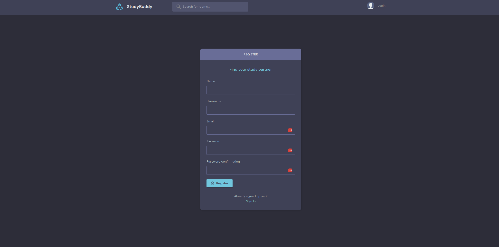
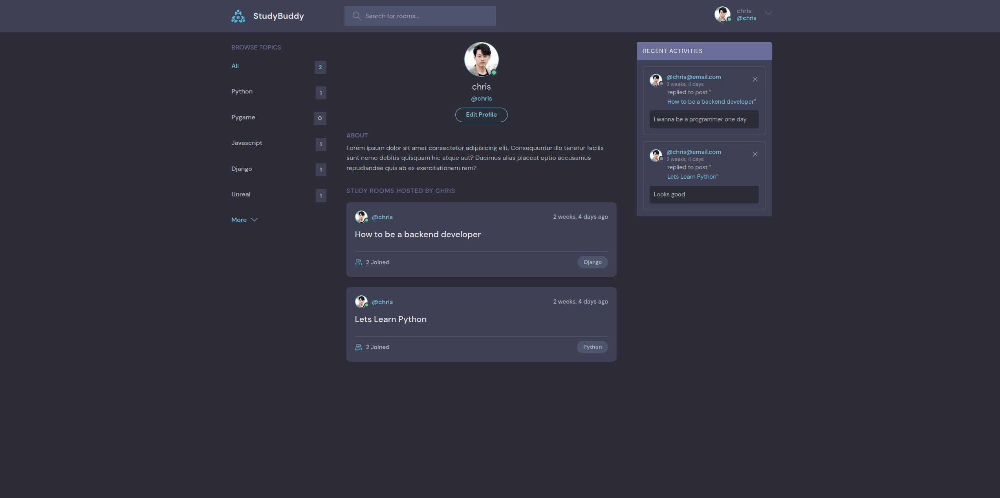
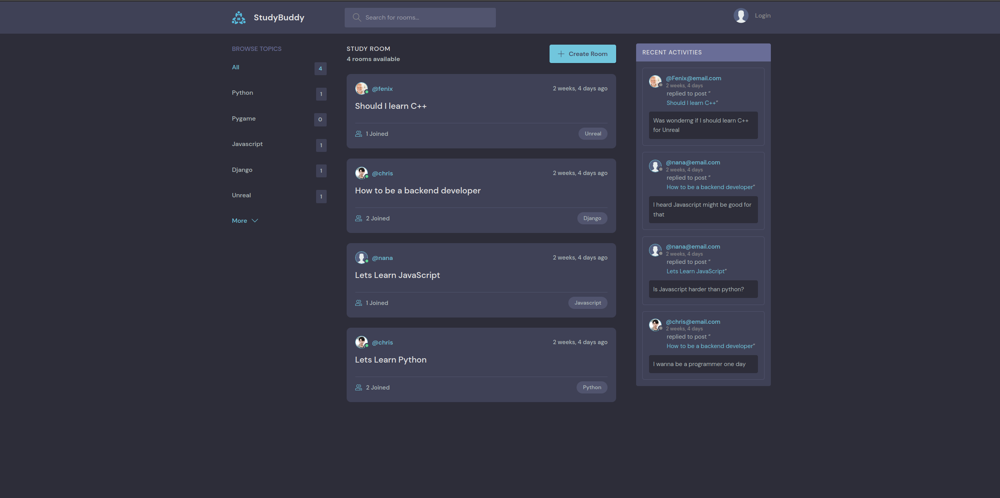
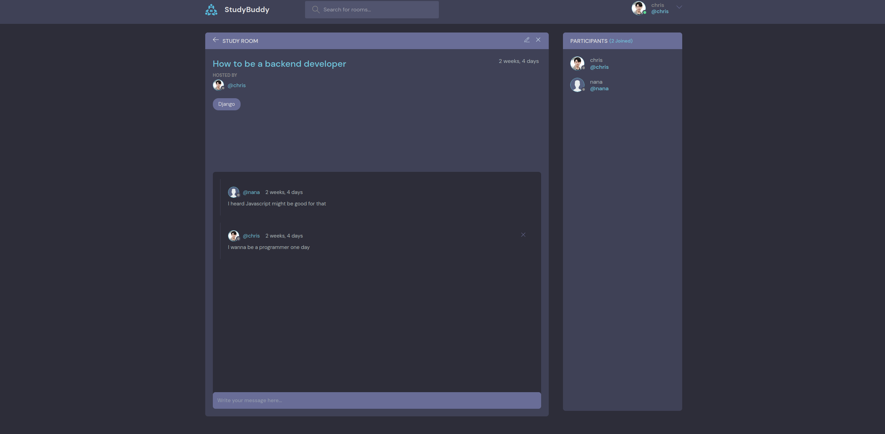

# studybud# studybud
Studybud is a website that provides a platform for people to study together and collaborate on software development. It features a chatroom where users can communicate and exchange ideas and knowledge. The goal of Studybud is to support and encourage individuals in their learning journeys and provide a space for them to connect and study with others.

## Features
- Profile creation - users can create and customize their own profiles.
- Chatroom creation - users can create chatrooms to discuss and collaborate on software development.
- Chatroom search - users can search for chatrooms based on specific topics or interests.
- Recent activities - users can view a feed of recent activities, such as new chatroom discussions, within the Studybud community.

## Installation
- 1 - clone repo https://github.com/Csluu/studybud.git
- 2 - Create a vritual environment and activate
    - pip install virtualenv
    - virtualenv envname
    - envname\scripts\activate
- 3 - cd into project "cd studybud"
- 4 - pip install -r requirements.txt
- 5 - python manage.py runserver

## Usage
**Login / Create Account**
- Create login credentials 

**Profiles**
- Edit your profile in the Account Tab

**Home**
- Search chatrooms by topic, see recent chatrooms, and activities or create a chatroom

**Chatroom**
- Participate and discuss 

## Insights and Takeaways
In building Studybud, I gained valuable experience working with various technologies and tools in web development, including Django, APIs, HTML, and JavaScript. This project gave me the opportunity to put my skills to use and create a functional and user-friendly website that provides a platform for people to study together and collaborate on software development.

By working on Studybud, I not only honed my technical skills but also gained experience in project planning, problem-solving, and teamwork. Building a website from scratch is a complex process that requires careful planning and execution, and by successfully completing this project, I demonstrated my ability to take on challenging projects and see them through to completion.

In summary, the Studybud project was a great learning experience that allowed me to deepen my understanding of web development and showcase my skills. Moving forward, I can leverage this experience and build upon my knowledge as I continue to grow as a software developer.

